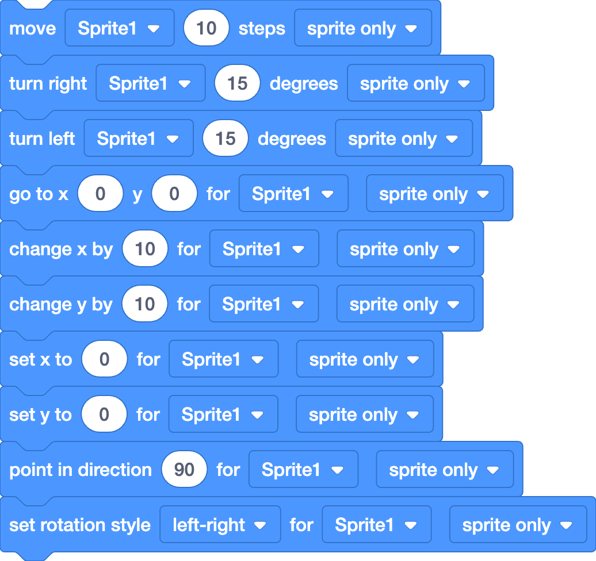

# Motion++ extension

## ✨ Features
Move any sprite from any script

Turn sprites clockwise or counter‑clockwise from any script

Set or change X/Y positions of a sprite from any script

Point sprites in any direction

Choose whether clones are affected or not

## Included Blocks

Motion ++ currently includes:

## Removed blocks

previously included the following blocks that were removed (they didn't work) :

point [sprite] towards [sprite]

if [sprite] on edge, bounce

## Feedback and Bug Reports

Please report bugs and suggest new blocks here :
https://github.com/tom35011/MotionPlusPlus/issues
